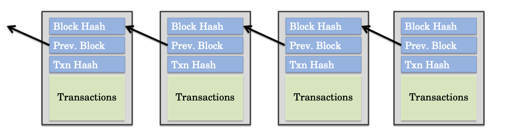
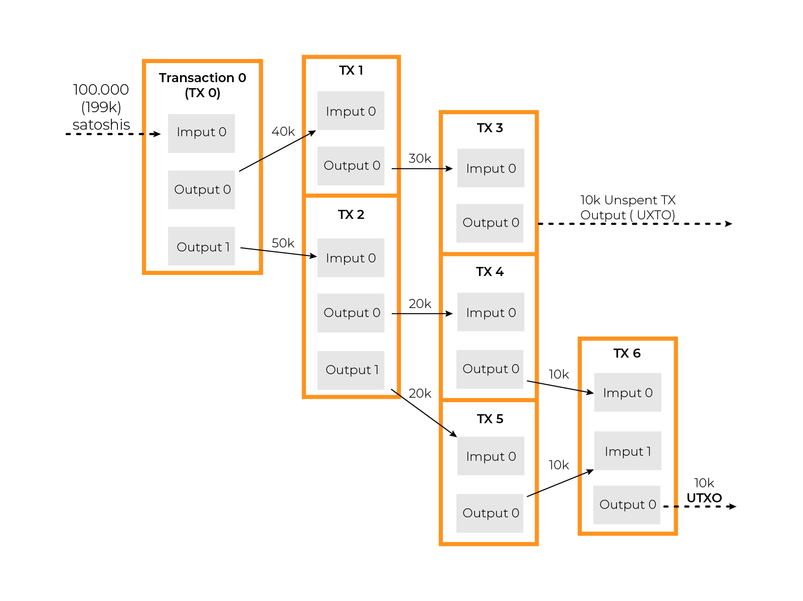
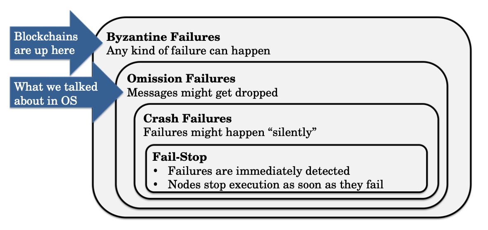

# Intro to Blockchain, UTXO model

Lecturer: Kai Mast

## Terminology

1. Server = Node

2. Blockchain = Decentralized ledger

   1. The *abstraction* provided to applications and users 

   2. Also, the data structure that holds transactions is usually a directed acyclic graph (DAG)

3. Blockchains Technologies (DLTs) = The protocol that decides how nodes operate and how they talk to each other

4. Permissionless blockchains = public blockchains

5. Unspent Transaction Outputs (UTXOs) set  ~= all unspent coins in the blockchain

## Centralized vs Decentralized System

Centralized System

- All servers (or **nodes**) are controlled by the same entity (e.g., Google)
- All nodes trust each other

Decentralized System e.g. **P2P Network**

- Spread data and execution across a many nodes run by different entities
- Nodes are **mutually distrusting**
- Not all participants need to be known 
- Each node is only connected to small number of other nodes
- **Permissionless** (or public) blockchains operate on a peer to peer network

## Decentralized ledger

1. Immutability
   1. Transactions cannot be removed from the ledger
   2. New transactions can be added to existing ones
2. Auditability
   1. A decentralized ledger history is public
   2. New nodes can join by replaying transaction history
3. Consistency
   1. no double spends are allowed in Bitcoin

## State

In UTXO model, State is stored outside of the blockchain itself, which means that the current state of a blockchain-based system is not stored directly within the blockchain data structure. Instead, it is stored in a separate database or data structure that can be easily queried and updated.

## UTXO

1. Each transaction in a blockchain consumes at least one and creates one or more UTXOs, and these UTXOs can be combined and spent as inputs in future transactions. Each UTXO can only be consumed at most once and only in its entirety. 
2. In a node (comparing to a transaction), UTXOs are stored in a data structure known as the **UTXO set**. This set is used to keep track of ***all*** the unspent outputs in the blockchain, and it is updated each time a new transaction is added to the blockchain. The UTXO set is used by nodes in the network to validate new transactions and ensure that the inputs being spent have not already been spent in previous transactions. They provide a way to keep track of the current state of the network. Your account balance is the combined value of all UTXOs you control. 
3. The difference between input and UTXO is the "transaction fee" charged by the owner of this node. The sum of a transactions inputs must be greater or equal to the sum of its outputs

## Failure Models 

